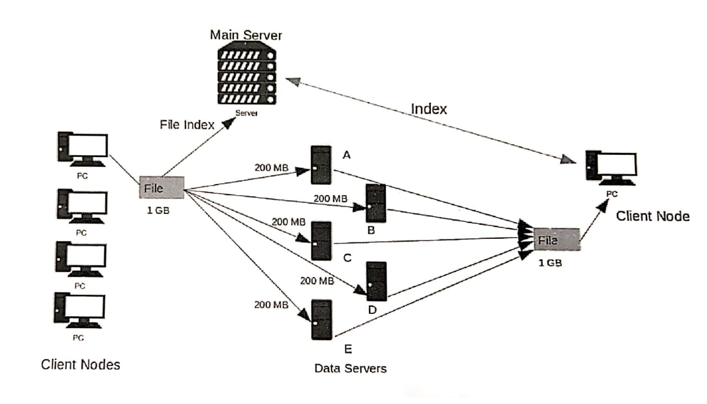

# Dloud

We present **Dloud - The Distributed Cloud**, here we tried to create our own *cloud
storage system* in a *Distributed way*.

## Idea
The main aim of our project- **Distributed Cloud** is to achieve higher speeds as compared to standard FTP server and to utilize free space on all desktops in a certain lab. The ‘Dloud’ contains multiple paths for files to be uploaded to data servers as well as makes way for faster retrieval of huge files like movies. Due to multithreading, we achieve high speed as compared to the single link FTP servers

## Motivation
The motivation to make our project came from the mediocre download speeds from the FTP links in our college labs as well as the inability to upload huge files to the centralised server. Using torrents required a fast internet connection which is expensive. Moreover, most institutions have systems that are not optimally utilized. Therefore a ‘Torrent-like’ software for a local network is an efficient way to handle both requirements

## Sample Screenshots

### Requirements
- Java (>1.8)
- Network Configuration to enable ports

## Flow of the System

- Basic Flow of the Code:
  - When GUI loads completely, Client connects to Main server.
  - User enters Login Credentials and sends that to Main server
  - Main server validates the credentials and sends the response back
  - If the login was successful, client requests for Data server IP addresses and connects then and the main UI of upload and download is rendered on Client side .
  - Client fetches list of server files from the files database from Main Server.

- Uploading the file to Dloud:
1. Client selects the file from file explorer which he/she wants to upload
2. Selected file is splitted in different parts
3. Those parts are sent to Data servers connected already in threads(parallely).
4. Data Servers continuously receive those files and store it in Files folder in hidden manner.
5. Then Client sends the File name uploaded and number of parts in which it was split and the owner of the file to the Main server to make entry in database of files
6. The list of server files are updated accordingly.
7. Then the splitted parts are cleaned from Client machine.
8. Uploading was successful

- Downloading the file to Dloud:
1. Client selects the file to be downloaded from the list of available files 
2. Client sends the name of the file he/she wants to all the Data servers.
3. Data Servers sends all the parts of that file it has to client parallely in threads.
4. Client receives all the parts in the Downloads folder in hidden manner.
5. Client merges all the parts, to make the actual file.
6. Then clients cleans all the part files received.
7. Downloading was successful, file was downloaded in the Downloads folder.

## Future Enhancements
- The software requires the nodes to have static IPs, which can be a potential vulnerability or threat for the system. Developments can be made to allow the nodes to have dynamic IPs.
- Whenever a node fails, the file part which it held would be no longer available and the system fails. A solution needs to be developed to handle this scenario.
- Educational institutes can use this software to host video lectures that will play on the go without any delay because of the speed of fetching contents.
- This system can be implemented on the Internet if we use IPv6 as it is a truly global identity. This will allow us to create a truly distributed file storage & sharing system.

## Team Members
Bhushan Pagare   
Purvesh Jain   
Manav Peshwani  
Hrishikesh Padhye   

### Are you Interested ?
- Fork the Repo
- Make some modifications
- Send the Pull Request :)
